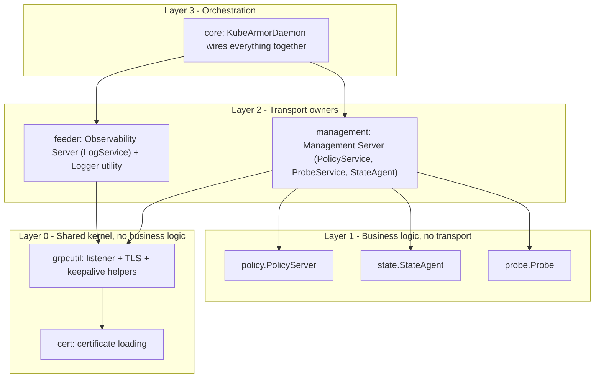
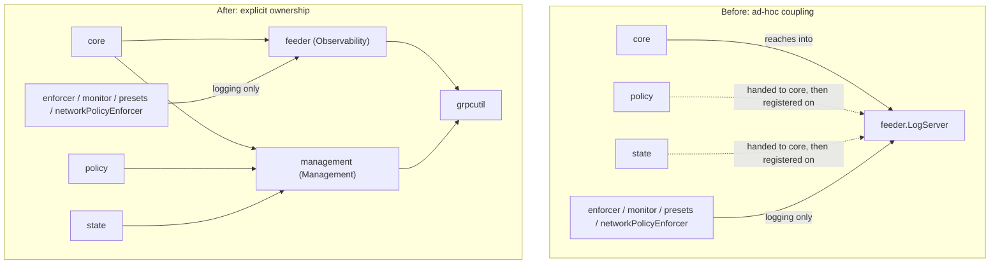
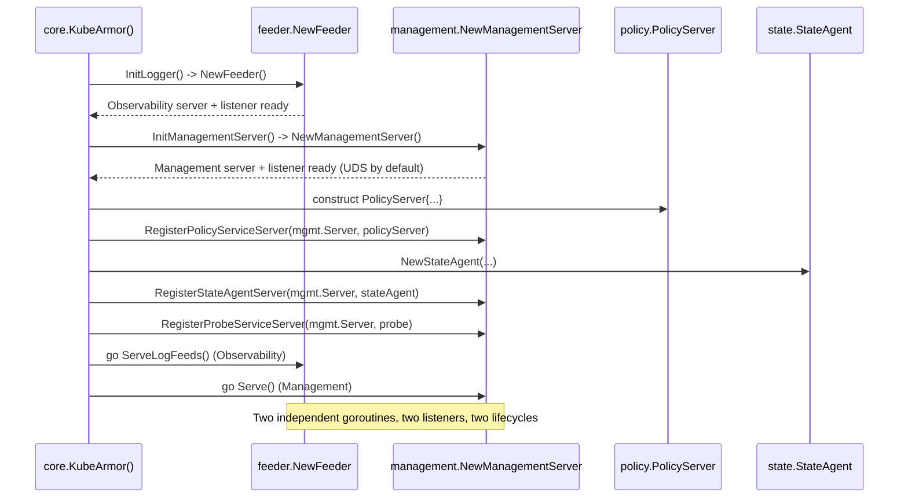

# Design Proposal: Where Should the Management gRPC Server Live?

A package-level design for registering KubeArmor's Management services (`PolicyService`, `ProbeService`, `StateAgent`) without overloading the `feeder` package

| | |
|---|---|
| **Status** | Draft for review |
| **Type** | Package-level architecture design proposal |
| **Relationship** | Follow-up / refinement of *"Separating KubeArmor's Observability Plane and Management Plane"* |
| **Scope** | `KubeArmor/KubeArmor/feeder`, `KubeArmor/KubeArmor/core`, `KubeArmor/KubeArmor/policy`, `KubeArmor/KubeArmor/state`, new `management` and `grpcutil` packages |
| **Prepared by** | Contributor Sagar Khandagre |

---

## Executive Summary

The previous proposal established *that* KubeArmor should split its gRPC surface into an **Observability Server** (`LogService`) and a **Management Server** (`PolicyService`, `ProbeService`, `StateAgent`). This document answers the natural follow-up question the split raises: **where, in the codebase, should the Management Server's transport and registration logic actually live?**

The `feeder` package's own doc comment states its job precisely: *"Package feeder is responsible for sanitizing and relaying telemetry and alerts data to connected clients."* Nothing in that charter mentions policy, probe, or state administration. Yet today, `core/kubeArmor.go` reaches into `dm.Logger.LogServer` — a field owned by `feeder` — and registers `PolicyService`, `ProbeService`, and `StateAgent` onto it. This document shows that this is a design smell, not a necessity: the business logic for these services already lives in clean, dedicated packages (`policy`, `state`, and `core`'s own `Probe`); only the *transport hosting* is misplaced.

**Recommendation:** introduce a small, dedicated `management` package — a peer of `feeder`, not a subordinate of it — that owns the Management Server's listener, `grpc.Server`, health/reflection registration, and lifecycle. Both `feeder` and `management` share a new, minimal, business-logic-free `grpcutil` package for TLS/listener/keepalive plumbing, so neither duplicates code nor depends on the other. `core` remains the single composition root that wires business-logic packages onto the correct transport.

---

## Part 1 — Understanding the Feeder's Real Job

### 1.1 What the code says feeder is for

```go
// Package feeder is responsible for sanitizing and relaying telemetry and alerts data to connected clients
package feeder
```

This is not an incidental comment — it matches everything the package actually does: `BaseFeeder` owns `EventStructs` (the `MsgStructs`/`AlertStructs`/`LogStructs` fan-out registries), `PushMessage`/`PushLog`/`PushAlert` feed them, and `logServer.go` implements exactly one gRPC service, `LogService`, streaming those events out. Every part of `feeder`'s design — bounded per-client queues, throttling state, the `LogService` handlers — exists to serve **one job: telemetry relay.**

### 1.2 Feeder's second, legitimate role: the injectable Logger utility

Feeder is not only a telemetry transport — it is also the **structured logging facade used almost everywhere else in the daemon.** Grepping the codebase shows `*fd.Feeder` injected as a `Logger` field into most other subsystems, used exclusively for `.Print` / `.Errf` / `.Warnf` / `.Debug` calls:

| Consumer package | Field | Used for |
|---|---|---|
| `enforcer` (`RuntimeEnforcer`, `BPFEnforcer`, `AppArmorEnforcer`, `SELinuxEnforcer`) | `Logger *fd.Feeder` | `.Print` / `.Errf` / `.Warnf` — status and error logging only |
| `monitor` (`SystemMonitor`) | `fd.Feeder` reference | Structured logging + raw event hand-off into `PushMessage` |
| `presets` (`base.Preset` and preset implementations) | `fd.Feeder` reference | `.Errf` / `.Print` for preset lifecycle logging |
| `networkPolicyEnforcer` | `fd.Feeder` reference | `.Errf` / `.Print` for enforcement status logging |
| `core` (`KubeArmorDaemon`) | `Logger *fd.Feeder` | Logging **and** (today) the transport being reused for management registration |

This table is the crux of the analysis: **every one of these consumers only ever touches feeder's logging surface.** None of them call, reference, or care about `LogServer`/`Listener`. Feeder is a legitimate, heavily-shared dependency for logging — that role must *not* be disturbed by this proposal. The problem is narrower and sharper than "feeder is overused" — it is specifically that **one field, `LogServer *grpc.Server`, is being treated as a general-purpose gRPC registration point** by code outside the package, for services that have nothing to do with feeder's charter.

### 1.3 Where the Management services' business logic *already* lives

This is the most important finding: **the business logic for the Management plane is already cleanly separated** — it is only the *transport wiring* that is not.

| Service | Business logic package | Package doc comment | Transport registration today |
|---|---|---|---|
| `PolicyService` | `KubeArmor/KubeArmor/policy` (`PolicyServer` struct) | *"Package policy handles policy updates over gRPC in non-k8s environment"* | `pb.RegisterPolicyServiceServer(dm.Logger.LogServer, policyService)` in `core/kubeArmor.go` |
| `StateAgent` | `KubeArmor/KubeArmor/state` (`StateAgent` struct) | *"package state implements the state agent service..."* | `pb.RegisterStateAgentServer(dm.Logger.LogServer, dm.StateAgent)` in `core/kubeArmor.go` |
| `ProbeService` | `core/karmorprobedata.go` (`Probe` struct) | (no dedicated package yet — lives directly in `core`) | `pb.RegisterProbeServiceServer(dm.Logger.LogServer, probe)` in `core/kubeArmor.go` |

`policy` and `state` are **already** independent, transport-free packages with zero knowledge of `grpc.Server`, TLS, or listeners — exactly the shape you want for business logic. The only place any of this reaches for a transport is three call sites in `core/kubeArmor.go`, and all three reach for the same wrong object: `dm.Logger.LogServer`.

---

## Part 2 — Why Registering Management Services on Feeder's Server Is a Design Smell

1. **It contradicts the package's own stated charter.** `feeder`'s doc comment says "telemetry and alerts." A reader who trusts that comment (as they should) will not expect to find `PolicyService` — a policy-mutation surface — reachable through the same object.
2. **It creates an invisible, non-local coupling.** The registration happens in `core/kubeArmor.go`, not in `feeder`, so nothing in the `feeder` package itself signals that its server now also serves administrative RPCs. Understanding the true shape of `dm.Logger.LogServer` requires reading a *different* package's 700-line orchestration function.
3. **It piggybacks on a fan-in dependency.** Because `enforcer`, `monitor`, `presets`, and `networkPolicyEnforcer` all depend on `feeder` (for logging), any future change to `feeder`'s server-hosting behavior — TLS settings, keepalive tuning, added interceptors for management auth — sits in the same package that a large, unrelated swath of the codebase imports and compiles against. This is exactly backwards: the packages with the least business relating to management (`enforcer`, `monitor`, etc.) end up structurally adjacent to management's transport code.
4. **It breaks the symmetry the codebase has already established.** `policy` and `state` are dedicated, transport-free packages — a clean precedent. Bolting their transport onto `feeder` (rather than giving them a transport-owning peer of their own) is an asymmetry: two of the three planes get a "home," Management does not.
5. **It has no natural growth boundary.** If the next management-facing RPC is added, the only existing precedent in the code is "register it on `dm.Logger.LogServer` too" — the anti-pattern compounds every time a new admin capability is added, because there is no alternative object to reach for.
6. **It complicates testing.** `feeder_test.go` builds a real `feeder.Feeder` with a real listener to test **telemetry** behavior. Any test that wants to exercise `PolicyService` today must also stand up a full feeder (with its file-output, throttle maps, and `EventStructs`) even though `PolicyService` has nothing to do with any of that.
7. **It is the same anti-pattern the first proposal identified, one layer down.** The original problem was "one `grpc.Server` for two planes." Fixing the transport split while still having `core` reach into a feeder-owned field for management registration would simply move the exact same coupling from *"one server, two planes"* to *"two servers, but the second one still lives inside the first one's package."* The fix is incomplete unless the package boundary is fixed too.

---

## Part 3 — Design Alternatives Considered

| Alternative | Description | Verdict |
|---|---|---|
| **A. Status quo** | Keep registering `PolicyService`/`ProbeService`/`StateAgent` on `dm.Logger.LogServer` (or its post-split successor, `dm.Logger.ObservabilityServer`) | **Rejected.** Reproduces the exact coupling described in Part 2; does not achieve real separation, only a cosmetic rename. |
| **B. Inline in `core`** | Add a second `grpc.Server` + listener directly as fields on `KubeArmorDaemon`, built inline inside `kubeArmor.go` | **Rejected as primary design.** `core` is already the largest, least modular package in the daemon (`kubeArmor.go` alone runs the entire `KubeArmor()` bring-up sequence). Adding ~100 lines of listener/TLS/keepalive bootstrap directly into it deepens the existing monolith rather than reducing it, and gives the Management transport no independently testable unit, unlike `feeder`, which already has `feeder_test.go`. |
| **C. Second server field inside `feeder`** | Add `fd.ManagementServer` alongside `fd.LogServer`, still inside the `feeder` package | **Rejected.** Every consumer that imports `feeder` purely for logging (`enforcer`, `monitor`, `presets`, `networkPolicyEnforcer` — see Part 1.2) would now compile against a package that also hosts control-plane transport code with no relation to their own concerns. It also makes `feeder`'s doc comment actively misleading and permanently entangles telemetry and management lifecycle (`DestroyFeeder` would now have to tear down two unrelated servers). |
| **D. Dedicated `management` package (recommended)** | A new package, peer to `feeder`, `policy`, and `state`, whose only job is to own the Management transport (listener, `grpc.Server`, health, reflection, lifecycle) and let `core` register business-logic structs onto it | **Recommended.** Restores symmetry with `policy`/`state`, keeps `feeder` honest to its doc comment, gives Management its own independently testable unit, and — critically — requires zero change to the packages that only use feeder for logging. |

---

## Part 4 — Recommended Architecture

### 4.1 Package layers (target state)



This is a strict four-layer dependency-inversion structure: dependencies only ever point downward. `feeder` and `management` never depend on each other. `policy`, `state`, and a proposed new `probe` package (extracting `Probe` out of `core/karmorprobedata.go` for symmetry — see Part 8) know nothing about gRPC transport at all; they simply implement the generated `pb.*Server` interfaces. `core` is the only package allowed to know about *both* transport and business logic, because composition is its job.

### 4.2 What changes vs. today



Note what does **not** change: `enforcer`, `monitor`, `presets`, and `networkPolicyEnforcer` keep exactly the same dependency on `feeder` they have today, for exactly the same reason (logging). This design change is entirely invisible to them.

### 4.3 Startup sequence



---

## Part 5 — Proposed Package Responsibilities

| Package | Owns | Does **not** own | Depended on by |
|---|---|---|---|
| `grpcutil` (new) | Listener construction (`tcp` / `unix`), TLS credential loading (wrapping `cert`), keepalive parameter profiles | Any `pb.*Server` implementation, any business logic | `feeder`, `management` |
| `feeder` (existing, narrowed) | `LogService` transport (listener, `grpc.Server`, health, reflection), the injectable `Logger` utility (`Print`/`Errf`/...), `EventStructs` fan-out | `PolicyService`, `ProbeService`, `StateAgent`, their registration | `core`, `enforcer`, `monitor`, `presets`, `networkPolicyEnforcer` |
| `management` (new) | Management transport (listener, `grpc.Server`, health, reflection), Unix Domain Socket default, its own TLS/keepalive profile | Any business logic for `PolicyService`/`ProbeService`/`StateAgent` — only registers structs handed to it | `core` |
| `policy` (existing, unchanged) | `PolicyServer` business logic (`containerPolicy`/`hostPolicy`/`networkPolicy`) | Any transport, listener, or TLS concern | `core` |
| `state` (existing, unchanged) | `StateAgent` business logic (`WatchState`/`GetState`) | Any transport, listener, or TLS concern | `core` |
| `probe` (new, extracted from `core`) | `Probe` business logic (`getProbeData`) | Any transport, listener, or TLS concern | `core` |
| `core` (existing, thinner) | Composition: constructs `feeder.Feeder` and `management.ManagementServer`, constructs `policy.PolicyServer` / `state.StateAgent` / `probe.Probe`, registers the latter onto the former | Any gRPC bootstrap logic (delegated to `grpcutil` via `feeder`/`management`) | — |

---

## Part 6 — API Sketch: the `management` Package

```go
// Package management owns the Management gRPC server: PolicyService,
// ProbeService, and StateAgent are registered onto it by core. This
// package has no knowledge of policy, probe, or state business logic —
// it only hosts the transport those services are registered on.
package management

import (
	"net"

	"google.golang.org/grpc"
	"google.golang.org/grpc/health"
)

// Server owns the Management plane's transport: its own listener,
// grpc.Server, health server, and lifecycle - independent of Observability.
type Server struct {
	Listener     net.Listener
	Server       *grpc.Server
	HealthServer *health.Server
	SocketPath   string // Unix Domain Socket path, default transport
	Addr         string // optional TCP fallback (e.g. localhost:PORT)
}

// Config controls how the Management server is constructed.
type Config struct {
	SocketPath   string // e.g. /var/run/kubearmor/kubearmor-management.sock
	FallbackAddr string // used only if UDS is unavailable (e.g. Windows)
	TLSEnabled   bool
	NodeIP       string
	EnableReflection bool
}

// NewServer builds and binds the Management transport but does not
// start serving; core registers business-logic servers first.
func NewServer(cfg Config) (*Server, error) { /* ... */ return nil, nil }

// Serve blocks, accepting Management RPCs. Call in a goroutine.
func (s *Server) Serve() error { /* ... */ return nil }

// GracefulStop drains in-flight management RPCs and stops the server,
// independent of the Observability server's lifecycle.
func (s *Server) GracefulStop() { /* ... */ }
```

## Part 7 — API Sketch: the Shared `grpcutil` Package

```go
// Package grpcutil provides transport-only helpers shared by feeder
// (Observability) and management (Management). It contains no
// business logic and knows nothing about any specific gRPC service.
package grpcutil

import (
	"net"
	"time"

	"google.golang.org/grpc/credentials"
	"google.golang.org/grpc/keepalive"
)

// ListenerKind selects the transport for a server.
type ListenerKind int

const (
	TCP ListenerKind = iota
	UnixSocket
)

// NewListener opens a TCP or Unix Domain Socket listener.
func NewListener(kind ListenerKind, addr string) (net.Listener, error) { return nil, nil }

// LoadServerTLS wraps the existing cert package to build server
// TransportCredentials, parameterized per caller (Observability vs
// Management can request different certificate/trust bundles).
func LoadServerTLS(nodeIP string, certPath string) (credentials.TransportCredentials, error) {
	return nil, nil
}

// Profile names a traffic shape so each server gets appropriately
// tuned keepalive settings instead of one shared hardcoded pair.
type Profile int

const (
	StreamingProfile Profile = iota // long-lived, e.g. Observability
	UnaryProfile                    // short-lived, e.g. Management
)

// KeepaliveFor returns tuned keepalive enforcement/parameters for a profile.
func KeepaliveFor(p Profile) (keepalive.EnforcementPolicy, keepalive.ServerParameters) {
	switch p {
	case UnaryProfile:
		return keepalive.EnforcementPolicy{PermitWithoutStream: true},
			keepalive.ServerParameters{Time: 30 * time.Second, Timeout: 10 * time.Second}
	default:
		return keepalive.EnforcementPolicy{PermitWithoutStream: true},
			keepalive.ServerParameters{Time: 1 * time.Second, Timeout: 5 * time.Second}
	}
}
```

`feeder.NewFeeder` is refactored to call `grpcutil.NewListener`/`grpcutil.LoadServerTLS`/`grpcutil.KeepaliveFor(grpcutil.StreamingProfile)` internally instead of hand-rolling that logic (today's private `loadTLSCredentials` in `feeder.go` moves here, unchanged in behavior). `management.NewServer` calls the same helpers with `grpcutil.UnaryProfile` and, by default, `grpcutil.UnixSocket`. Neither package imports the other.

---

## Part 8 — Migration Plan

This is intentionally incremental — every step compiles and runs on its own:

1. **Extract `grpcutil`.** Move `loadTLSCredentials` and the `kaep`/`kasp` construction out of `feeder.go` into the new `grpcutil` package, unchanged in behavior. Update `feeder.go` to call it. *(No externally visible change.)*
2. **Introduce the `management` package.** Add `management.Server`/`management.Config`/`NewServer`/`Serve`/`GracefulStop`, built on `grpcutil`, defaulting to a Unix Domain Socket. *(New code, not yet wired in.)*
3. **Extract `probe`.** Move `Probe`/`GetProbeData` out of `core/karmorprobedata.go` into a new `probe` package, for symmetry with `policy` and `state`. `SetProbeContainerData` (which touches `dm.Containers`/`dm.EndPoints`) stays on `KubeArmorDaemon` in `core`, since it is genuinely daemon state, not probe-service logic; only the `pb.ProbeServiceServer` implementation moves.
4. **Add `dm.ManagementServer` to `KubeArmorDaemon`.** In `core/kubeArmor.go`, add `InitManagementServer()`/`CloseManagementServer()` mirroring the existing `InitLogger()`/`CloseLogger()` pattern.
5. **Re-point the three registration call sites.** Change:
   - `pb.RegisterPolicyServiceServer(dm.Logger.LogServer, policyService)` → `pb.RegisterPolicyServiceServer(dm.ManagementServer.Server, policyService)`
   - `pb.RegisterProbeServiceServer(dm.Logger.LogServer, probe)` → `pb.RegisterProbeServiceServer(dm.ManagementServer.Server, probe)`
   - `pb.RegisterStateAgentServer(dm.Logger.LogServer, dm.StateAgent)` → `pb.RegisterStateAgentServer(dm.ManagementServer.Server, dm.StateAgent)`
6. **Split health/reflection.** Give `dm.ManagementServer` its own `health.Server` and its own `reflection.Register` call, independent of `dm.GRPCHealthServer` (which stays scoped to `feeder`/Observability).
7. **Split lifecycle.** `DestroyKubeArmorDaemon()` calls `dm.ManagementServer.GracefulStop()` alongside (not instead of) `dm.CloseLogger()`, so either can fail or drain independently.
8. **Update deployment/config surface.** Add `cfg.GlobalCfg` fields for the management socket path/TLS, and update the KubeArmorOperator's manifests/RBAC if the management endpoint needs a mount (Unix socket volume) instead of a Service port.

Each step leaves the daemon in a working, testable state — this can land as a sequence of small PRs rather than one large rewrite.

---

## Part 9 — Testing Implications

- `management` gets its own `management_test.go`, following the exact pattern `feeder_test.go` already established (`net.Listen("tcp", ":0")` for a throwaway test listener) — but without needing to construct a full `Feeder` (file output, `EventStructs`, throttle maps) just to test a unary RPC registration.
- `policy` and `state` tests remain entirely unchanged — they already test business logic against interfaces, not against a live server.
- `core`-level integration tests can now spin up **just** `management.Server` to test policy-push behavior, or **just** `feeder.Feeder` to test log streaming, instead of always needing the full daemon bring-up.

---

## Part 10 — Industry Precedent for This Specific Question

This proposal is about *package-level* ownership of service registration — a narrower and more code-structural question than the transport-level split in the first proposal. The clearest industry precedent is Kubernetes' own **generic API server** design:

Kubernetes' `k8s.io/apiserver` defines a `RESTStorageProvider` interface — each API group (apps, batch, authorization, etc.) implements `NewRESTStorage(...) (APIGroupInfo, error)` in **its own dedicated package** (e.g., `k8s.io/kubernetes/pkg/registry/authorization/rest`), with zero knowledge of HTTP transport, TLS, or listener setup. A separate, shared `genericapiserver` package (`k8s.io/apiserver/pkg/server`) owns the actual transport — listeners, TLS, request routing — and a composition root (`cmd/kube-apiserver/app/server.go`, `CreateServerChain`) wires every group's `RESTStorageProvider` onto the shared server. Kubernetes has actively refactored *away from* ad-hoc, legacy storage wiring toward this standard provider pattern (e.g., [kubernetes/kubernetes#119042](https://github.com/kubernetes/kubernetes/issues/119042), "turn core (legacy) rest storage into standard `RESTStorageProvider`" — explicitly framed as reducing "spaghetti" wiring) — the same direction this proposal recommends for KubeArmor: move `PolicyService`/`ProbeService`/`StateAgent` off of ad-hoc registration onto a standard, dedicated transport-owning package.

This mirrors the proposed KubeArmor shape almost exactly:

| Kubernetes concept | KubeArmor equivalent |
|---|---|
| `RESTStorageProvider` implementation per API group (`pkg/registry/*/rest`) | `policy.PolicyServer`, `state.StateAgent`, `probe.Probe` |
| `genericapiserver` (shared transport, no business logic) | `management` package (+ shared `grpcutil` kernel) |
| `CreateServerChain` / `cmd/kube-apiserver/app/server.go` (composition root) | `core/kubeArmor.go`'s `KubeArmor()` |
| Refactor away from legacy ad-hoc storage wiring (#119042) | This migration: away from `dm.Logger.LogServer` reuse |

Reference: [Kubernetes apiserver ARCHITECTURE.md](https://github.com/kubernetes/apiserver/blob/master/ARCHITECTURE.md); [`RESTStorageProvider` pattern](https://github.com/kubernetes/kubernetes/blob/master/pkg/controlplane/apiserver/apis.go); [kubernetes/kubernetes#119042](https://github.com/kubernetes/kubernetes/issues/119042).

---

## Part 11 — Risks and Mitigations

| Risk | Mitigation |
|---|---|
| Adding a new package (`management`) increases the package count and import graph size | The package is small (listener + `grpc.Server` + health/reflection lifecycle, no business logic) and mirrors `feeder`'s already-understood shape — low cognitive overhead for maintainers already familiar with `feeder` |
| Duplicated TLS/keepalive logic between `feeder` and `management` if `grpcutil` is skipped | `grpcutil` is a required part of this proposal specifically to prevent that duplication |
| Migration touches `core/kubeArmor.go`, a large and sensitive file | The migration plan (Part 8) is staged so each step is small, compiles independently, and can be reviewed/reverted in isolation |
| Unix Domain Socket default may not suit all deployment environments (e.g., Windows nodes) | `management.Config.FallbackAddr` supports a `localhost`-bound TCP fallback, matching the transport-flexibility recommendation from the first proposal |
| Extracting `probe` from `core` could be seen as scope creep | Framed as optional (Part 8, step 3) for symmetry; the core recommendation (a dedicated `management` package) stands even if `Probe` stays in `core` |

---

## Conclusion

The first proposal established that KubeArmor needs two gRPC transports: one for Observability, one for Management. This document answers where the second one should actually be built: **not inside `feeder`**, which is correctly scoped to telemetry relay and is too widely depended-upon (by `enforcer`, `monitor`, `presets`, `networkPolicyEnforcer`) to also carry control-plane transport concerns, but in a **new, dedicated `management` package** — a peer of `feeder`, symmetric with the already-well-separated `policy` and `state` business-logic packages, and built on a small shared `grpcutil` kernel so neither transport owner duplicates code or depends on the other. `core` remains the single, explicit composition root, exactly mirroring the `RESTStorageProvider` / `genericapiserver` pattern Kubernetes itself uses to keep API-group business logic separate from server transport. This is a incremental, low-risk migration (Part 8) that can land as a sequence of small, independently reviewable changes.

---

## References

- KubeArmor source: `KubeArmor/KubeArmor/feeder/feeder.go`, `KubeArmor/KubeArmor/feeder/logServer.go`, `KubeArmor/KubeArmor/core/kubeArmor.go`, `KubeArmor/KubeArmor/core/karmorprobedata.go`, `KubeArmor/KubeArmor/policy/policy.go`, `KubeArmor/KubeArmor/state/stateAgent.go`, `KubeArmor/KubeArmor/enforcer/*.go`, `KubeArmor/KubeArmor/monitor/systemMonitor.go`, `KubeArmor/KubeArmor/presets/*`, `KubeArmor/KubeArmor/networkPolicyEnforcer/networkPolicyEnforcer.go`.
- Kubernetes generic apiserver: [ARCHITECTURE.md](https://github.com/kubernetes/apiserver/blob/master/ARCHITECTURE.md), [`RESTStorageProvider` / `apis.go`](https://github.com/kubernetes/kubernetes/blob/master/pkg/controlplane/apiserver/apis.go), [`genericapiserver.go`](https://github.com/kubernetes/apiserver/blob/master/pkg/server/genericapiserver.go), [kubernetes/kubernetes#119042](https://github.com/kubernetes/kubernetes/issues/119042).
- Prior proposal: *Separating KubeArmor's Observability Plane and Management Plane* (`observability_management_plane_separation.md` / `.pdf`, same directory).
