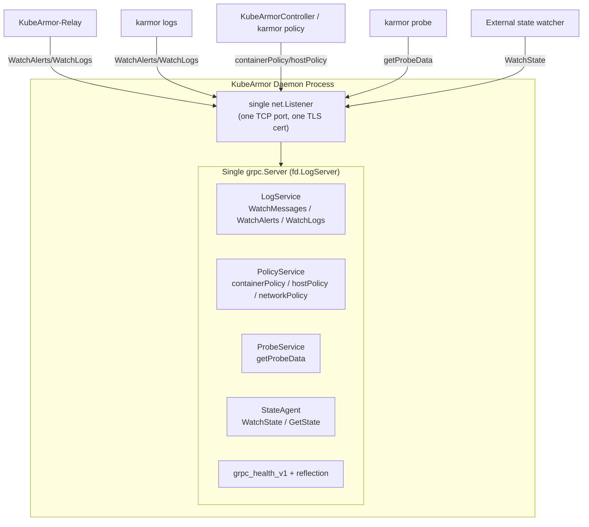
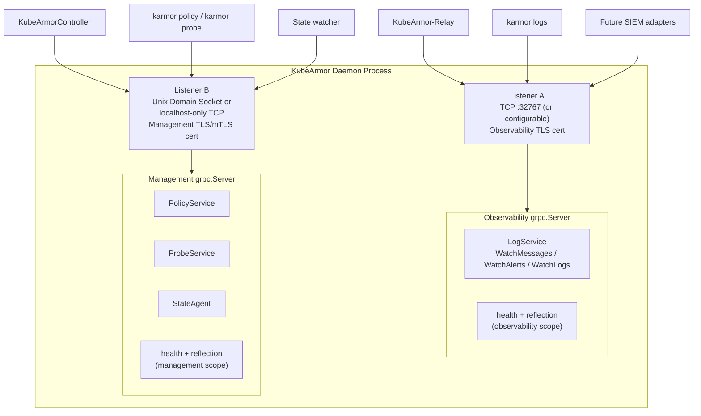
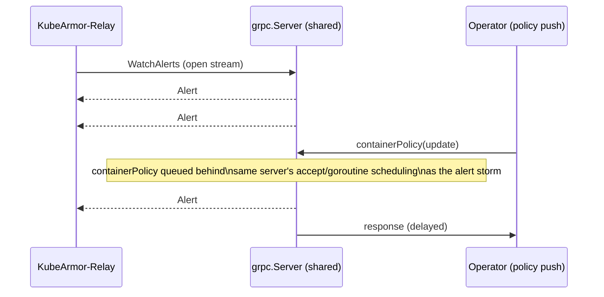
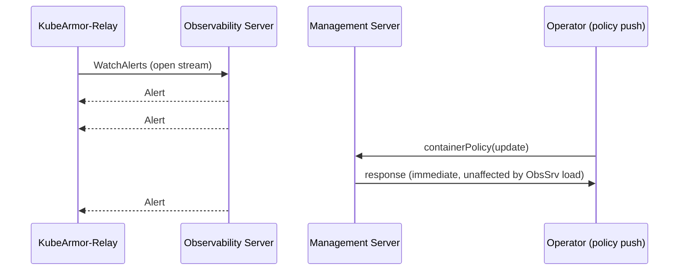

# Architecture Proposal: Separating KubeArmor's Observability Plane and Management Plane

| | |
|---|---|
| **Status** | Draft for review |
| **Type** | Architecture design proposal |
| **Scope** | `KubeArmor/KubeArmor/feeder`, `KubeArmor/KubeArmor/core`, `protobuf/` |
| **Audience** | KubeArmor maintainers, CNCF SIG-Runtime-Security reviewers, infrastructure engineers |
| **Prepared by** | Contributor Sagar Khandagre |

---

## Executive Summary

KubeArmor currently multiplexes four gRPC services — `LogService`, `PolicyService`, `ProbeService`, and `StateAgent` — onto a **single `grpc.Server` instance** (`fd.LogServer` in `KubeArmor/KubeArmor/feeder/feeder.go`), bound to a **single TCP listener**, secured by a **single TLS certificate**, and governed by a **single set of keepalive/interceptor settings**.

These four services are not peers. `LogService` is a high-volume, long-lived, read-only **telemetry stream** consumed by fan-out components such as KubeArmor-Relay and `karmor logs`. `PolicyService`, `ProbeService`, and `StateAgent` are low-volume, latency-sensitive, **administrative/control RPCs** consumed by orchestrators, operators, and human administrators. Coupling them at the transport layer means a telemetry storm can starve a policy update, a single certificate rotation affects both planes, and a single misconfigured interceptor can take down enforcement control alongside log delivery.

This proposal recommends splitting the daemon's gRPC surface into two independently-configured `grpc.Server` instances:

- **Observability Server** — `LogService` only. Optimized for high fan-out, long-lived streaming, and external SIEM/log-pipeline exposure.
- **Management Server** — `PolicyService`, `ProbeService`, `StateAgent`. Optimized for low-latency administrative operations, tightly scoped trust (e.g. Unix Domain Socket or `localhost`-only), and future authn/authz enforcement.

This mirrors an architectural pattern already validated at scale across the cloud-native ecosystem: Kubernetes (API server vs. kubelet read-only/secure ports), etcd (client port vs. peer port), Istio (Envoy data plane vs. Istiod control plane), Cilium/Hubble (embedded gRPC + Unix socket vs. Hubble Relay), SPIRE (Workload API over UDS vs. Server API over mTLS/TCP), and Falco (deprecating its own single embedded gRPC server model in favor of Unix-socket-first, decoupled output distribution). The remainder of this document analyzes the current design, justifies the split, and proposes a concrete target architecture.

---

## Part 1 — Understanding the Existing Responsibilities

### 1.1 The Observability Plane (Data Plane)

**Purpose.** The observability plane exists to move a continuous stream of runtime security telemetry — system events, policy-violation alerts, and audit-style logs — from the point of collection (in-kernel eBPF/LSM hooks, translated by `KubeArmor/KubeArmor/monitor` and `KubeArmor/KubeArmor/feeder`) to the point of consumption (log processors, SIEMs, humans). It is, in essence, **a telemetry pipeline that happens to be implemented as a gRPC service**, not a management API that happens to emit logs.

**Components that belong to it, grounded in the current codebase:**

- `LogService` (`KubeArmor/protobuf/kubearmor.proto`) — exposes `WatchMessages`, `WatchAlerts`, `WatchLogs`, all of which are **server-streaming RPCs**; the client opens one long-lived stream and receives events indefinitely.
- `feeder.BaseFeeder` / `feeder.Feeder` (`KubeArmor/KubeArmor/feeder/feeder.go`) — owns the `EventStructs` in-memory fan-out registry (`MsgStructs`, `AlertStructs`, `LogStructs`), each guarded by its own lock and pushed to via `PushMessage`/`PushLog`/`PushAlert`.
- `logServer.go` (`KubeArmor/KubeArmor/feeder/logServer.go`) — implements the per-client subscription lifecycle: `AddAlertStruct`/`AddLogStruct` register a bounded channel (`QueueSize: 1000`) per connected client, and the handler blocks on `svr.Send()` for the lifetime of the connection.
- **KubeArmor-Relay** — an external, independently-deployed component (see `pkg/KubeArmorOperator/common/defaults.go`, `KubeArmorRelayServerSecretName`, `GetRelayDeployment`) that connects to `LogService` as a client, aggregates logs/alerts across every node's `LogService` endpoint, and re-serves them to downstream consumers.
- `karmor logs` — the CLI client that either talks to a node's `LogService` directly (standalone/VM mode) or through the Relay (Kubernetes mode) to tail alerts/logs interactively.
- Future SIEM / log-pipeline adapters (e.g. Elasticsearch, Splunk, Fluent Bit sidecars) that need a stable, high-throughput, read-only feed.

**Client characteristics.** Observability clients are typically **long-lived, few-in-number-but-high-bandwidth, and read-only**. A single Relay connection may stay open for the lifetime of the pod and carry thousands of events per second during an incident. Clients never need to mutate state; they only `Watch*`.

**Traffic characteristics.**
- Predominantly **server push** over a small number of persistent HTTP/2 streams.
- **Bursty and adversary-correlated**: a container escape attempt, a crypto-miner, or a fork-bomb can generate thousands of alerts per second — precisely when the system is under the most stress and policy responsiveness matters most.
- Backpressure is already partially modeled today (`QueueSize: 1000`, drop/throttle logic in `AlertMap`/`AlertThrottleState`), which is itself evidence that this plane needs **its own** flow-control policy independent of anything else running on the same server.

**Scalability requirements.** Must scale with **event volume**, which is a function of workload count, policy verbosity, and attack surface — not with the number of administrative operations happening on the node. In large clusters (thousands of nodes, each streaming to a shared Relay tier) the observability plane is the dominant resource consumer of the KubeArmor gRPC surface by orders of magnitude.

**Why it is fundamentally a telemetry pipeline.** Every RPC in `LogService` is one-way, unbounded in duration, and stateless with respect to enforcement — the daemon's behavior (what gets blocked, what gets logged) never changes because a `WatchAlerts` client connected or disconnected. This is the defining property of a data-plane/telemetry component: it observes and exports; it does not decide.

### 1.2 The Management Plane (Control Plane)

**Purpose.** The management plane exists to let trusted operators and orchestration components **change what KubeArmor enforces** and **inspect its administrative/runtime state** — i.e., to drive the daemon's control loop, not to read its output.

**Services that belong to it:**

- `PolicyService` (`KubeArmor/protobuf/policy.proto`) — `containerPolicy`, `hostPolicy`, `networkPolicy`. Unary RPCs that push a serialized policy object and mutate `dm.SecurityPolicies` / `dm.Node` state (`KubeArmor/KubeArmor/core/kubeArmor.go`, `ParseAndUpdateContainerSecurityPolicy` and siblings). This is the non-Kubernetes (VM/bare-metal/systemd) analogue of what the Kubernetes CRD controller does via the API server in K8s mode.
- `ProbeService` (`KubeArmor/protobuf/policy.proto`) — `getProbeData`. A unary, on-demand introspection RPC (`KubeArmor/KubeArmor/core/karmorprobedata.go`) returning currently loaded containers, hosts, and policies — used by `karmor probe` for debugging/inspection, not for continuous consumption.
- `StateAgent` (`KubeArmor/protobuf/state.proto`) — `WatchState`, `GetState`. Pushes structured state-change events (container/node lifecycle) — administrative/state-sync traffic consumed by external state trackers (dashboards, state-aware controllers), gated behind `cfg.GlobalCfg.StateAgent` and only active in non-K8s mode (`KubeArmor/KubeArmor/core/kubeArmor.go`, `InitStateAgent`).

**Clients that consume it:** the `karmor` CLI (policy push, probe, debug), the KubeArmorController/operator in orchestrated deployments, provisioning/automation scripts in VM mode, and (in the future) any external policy-management or GitOps system reconciling desired policy state onto the node.

**Why it is fundamentally different from telemetry.** Management RPCs are **imperative and stateful**: calling `containerPolicy` changes what the enforcer (LSM/eBPF) permits from that point forward. A dropped or delayed management RPC has a direct, immediate security consequence — a policy update that should have blocked a newly-scheduled workload didn't arrive in time. Management traffic is low-volume (bytes per call, calls per minute-to-hour, not per second), latency-sensitive in a *correctness* sense rather than a throughput sense, and requires a fundamentally different trust bar: only entities authorized to change enforcement behavior should be able to reach it at all.

---

## Part 2 — Current Design Problems

The problem is not merely "telemetry and control share a TLS cert." The two planes are coupled across nearly every architectural dimension, and none of that coupling is intentional — it is an artifact of `dm.Logger.LogServer` being the only `grpc.Server` the daemon happens to construct.

| Dimension | Observability plane (`LogService`) | Management plane (`PolicyService`, `ProbeService`, `StateAgent`) | Consequence of sharing one `grpc.Server` |
|---|---|---|---|
| **Client responsibility** | Passive consumer: read-only stream tailing | Active operator: mutates enforcement state | A read-only client and a state-mutating client are indistinguishable at the transport layer; least-privilege can't be expressed |
| **Trust assumption** | "May observe security events" | "May change what is enforced" | Currently identical trust is required to reach *either* — there is no way to grant one without the other |
| **Traffic pattern** | Few long-lived streams, continuous push | Many short-lived unary calls, bursty on policy change | Both share the same keepalive (`kaep`/`kasp`) and connection settings tuned for neither case specifically |
| **Workload shape** | I/O-bound fan-out to N subscribers | CPU/lock-bound: policy parsing, enforcer syscalls | A slow `WatchAlerts` consumer occupies goroutines/buffers that management RPCs indirectly compete for on the same server's accept loop |
| **Latency requirement** | Throughput-sensitive (don't drop events) | Correctness-sensitive (policy must land before the workload runs) | No independent queue sizing or scheduling priority between the two exists today |
| **Availability requirement** | "Nice to lose a few seconds of stream during restart" | "Must always be reachable to push an emergency policy" | One `Serve()` failure (`ServeLogFeeds`) takes down policy delivery too, since it's the same listener/server object |
| **Scaling characteristic** | Scales with event volume × number of downstream consumers (Relay fan-in, SIEM) | Scales with number of administrators/controllers, effectively O(1) per node | You cannot size the log path (e.g. bigger buffers, more streams) without also touching the code path that serves policy pushes |
| **Client lifecycle** | Long-lived (pod/process lifetime), reconnect-and-resume semantics | Short-lived, transactional, request/response | Reflection (`reflection.Register(dm.Logger.LogServer)`) exposes *both* surfaces to any client that can reach the port at all |
| **Operational ownership** | Owned by observability/SIEM teams, log infra, SREs | Owned by security/platform teams enforcing policy | Both teams must coordinate on the same certificate, the same port, the same firewall rule, and the same on-call rotation |
| **Failure domain** | A log storm, a stuck subscriber, or a downstream SIEM outage backpressures the stream | A malformed policy blob or a slow enforcer syscall blocks a unary RPC | Because they're one `grpc.Server`, a failure/backpressure event in one is not isolated from the other's goroutine pool and listener socket |
| **Resource utilization** | High: buffers `QueueSize: 1000` per stream × N streams, marshal/unmarshal of high-cardinality event structs | Low: single small policy blob per call | There's no way to give the log path more memory/goroutine budget without over-provisioning the (rarely used) management path identically, or vice versa |

**Why this matters beyond security.** It would be easy to reduce this to "the ports should be different for security reasons," but the deeper issue is that **KubeArmor is currently unable to reason about, size, or operate these two planes independently**, because the code has only one seam — `dm.Logger.LogServer` — through which every gRPC concern (TLS, keepalive, health, reflection, service registration) flows. Concretely, today:

- `fd.LogServer = grpc.NewServer(grpc.Creds(tlsCredentials), grpc.KeepaliveEnforcementPolicy(kaep), grpc.KeepaliveParams(kasp))` in `feeder.go` is constructed **once**, and `PolicyService`/`ProbeService`/`StateAgent` are registered onto that same object later in `kubeArmor.go` (`pb.RegisterPolicyServiceServer(dm.Logger.LogServer, policyService)`, etc.).
- TLS is all-or-nothing (`cfg.GlobalCfg.TLSEnabled`): you cannot require mTLS for policy pushes while leaving log streaming on a simpler trust model, or vice versa, without a second listener.
- `reflection.Register(dm.Logger.LogServer)` advertises every service — telemetry and control alike — to anything that can complete a TCP handshake with the port.
- There is exactly one `net.Listener` (`fd.Listener`, bound to `cfg.GlobalCfg.GRPC`), so there is no way to bind management to `localhost`/a Unix Domain Socket while still exposing observability externally (or the reverse) without a structural change.
- Health status is tracked per-service (`dm.SetHealthStatus(pb.PolicyService_ServiceDesc.ServiceName, ...)`) but is served by the *same* health endpoint as the log service, so a health probe cannot cheaply express "is management up" independently of "is the log pipe up."

These two logical planes are coupled purely because they happen to share a transport object that was originally created to serve logs — `PolicyService`/`ProbeService`/`StateAgent` were bolted onto it later (`pb.RegisterPolicyServiceServer(dm.Logger.LogServer, ...)`) as a convenience, not as a deliberate design decision.

---

## Part 3 — Proposed Architecture

### 3.1 Current State

Every consumer — regardless of trust level, traffic shape, or purpose — terminates on the same socket, the same certificate, and the same `grpc.Server` scheduling domain.

### 3.2 Proposed State

### 3.3 What changes structurally

- **Separate listeners.** Two `net.Listener`s replace `fd.Listener`: one for observability (kept on the existing configurable TCP port for backward compatibility), one for management (defaulting to a Unix Domain Socket under `/var/run/kubearmor/`, with an optional `localhost`-bound TCP fallback for environments without UDS support, e.g. some Windows/VM deployments).
- **Separate `grpc.Server` instances.** `fd.LogServer` becomes `fd.ObservabilityServer`; a new `dm.ManagementServer` (or `fd.ManagementServer`, depending on ownership) is constructed independently, each with its own `grpc.ServerOption` set.
- **Separate TLS configuration.** `loadTLSCredentials` is parameterized per-server: the observability server can keep the existing relay-facing certificate chain (`kubearmor-relay-server-certs`), while the management server can use a distinct, more tightly scoped certificate/trust bundle — enabling mTLS-only management without forcing every log consumer to hold a client certificate.
- **Separate interceptors/middleware.** Each server gets its own `grpc.ChainUnaryInterceptor`/`grpc.ChainStreamInterceptor` stack — e.g., rate limiting and audit logging on the management server, and payload-size/backpressure tuning on the observability server — instead of one shared interceptor chain that must satisfy both.
- **Separate certificates and trust domains.** The management server's certificate can be scoped to a distinct SPIFFE-like trust domain/CA intended only for administrative clients (operator, CLI), decoupling "who can read logs" from "who can change policy" at the cryptographic identity layer, not just the RBAC layer.
- **Independent lifecycle.** `ObservabilityServer.GracefulStop()` and `ManagementServer.GracefulStop()` can be sequenced independently during shutdown/reload — e.g., drain log subscribers first while continuing to accept an in-flight emergency policy push, or vice versa.
- **Independent deployment options.** Because they are separate listeners, an operator can choose to expose only the observability port through a Kubernetes `Service`/`NetworkPolicy` while leaving the management port reachable only via a sidecar or `exec`-based Unix socket mount — without any code change, purely through deployment configuration.
- **Transport flexibility.** The management server is a natural fit for a Unix Domain Socket (as Falco, Cilium/Hubble, and SPIRE's Workload API already do for their most sensitive/local surfaces), since its primary clients (CLI, local operator sidecar) are typically co-located, while the observability server remains TCP+TLS since its primary clients (Relay, SIEM) are typically remote.

### 3.4 Sequence Diagrams

**Today: policy push and log streaming interleave on one server**

**Proposed: independent scheduling per plane**

---

## Part 4 — Architecture Benefits

### Security

- **Principle of least privilege.** A component that only needs to read logs (Relay, SIEM adapter) never needs — and therefore never holds — credentials capable of pushing policy.
- **Trust domain separation.** Observability and management can be issued certificates from different intermediate CAs / SPIFFE trust domains, so a compromised log consumer cannot present a certificate that is also valid for policy mutation.
- **Certificate separation** limits the blast radius of a leaked key: a leaked observability certificate lets an attacker read logs; it should never let them push a policy.
- **Independent authentication.** The management server can require mTLS or a bearer token unconditionally, even if the observability server (for compatibility or performance reasons) allows a lighter-weight authentication mode.
- **Future authorization.** A per-RPC authorization interceptor (e.g., "this client identity may call `hostPolicy` but not `networkPolicy`") is far easier to reason about and test when the interceptor chain is scoped to management RPCs only.
- **RBAC friendliness.** Kubernetes `NetworkPolicy`/`AuthorizationPolicy`-style controls map naturally onto "port A is observability, port B is management" — much harder to express when both are on one port.
- **Easier audit.** Audit logging of "who changed policy" is a clean, low-volume log stream when isolated from telemetry; mixed together, it's a needle in a haystack of routine `WatchAlerts` traffic.

### Performance

- **Independent thread pools / goroutine scheduling.** Each `grpc.Server` runs its own accept loop and per-stream goroutines; a log fan-out storm no longer contends with the goroutines handling a `containerPolicy` unary call.
- **No starvation between telemetry and control** — this is the direct fix for the sequence-diagram scenario in §3.4.
- **Independent queue sizing.** The observability server's per-client buffers (`QueueSize: 1000` today) can be tuned for throughput without affecting the management server's (much smaller) resource footprint.
- **Independent backpressure.** A slow observability consumer can be throttled or disconnected without any risk of that logic ever touching the management path.
- **Separate resource allocation** — e.g., cgroup/goroutine budget planning per plane instead of one undifferentiated budget.
- **Better latency for policy operations**, because they are no longer queued behind whatever the observability server's scheduler is doing.

### Scalability

- **Independent scaling.** In a future disaggregated deployment (e.g., a per-node agent plus a separate management sidecar), the two servers can scale on entirely different axes.
- **High-volume log streaming vs. low-volume management RPCs** are no longer forced through identical connection/keepalive tuning.
- **Better horizontal scaling** of downstream consumers: Relay replicas can scale with event volume without any coupling to how many operators are pushing policy.

### Reliability

- **Log storms cannot delay policy updates** (and, symmetrically, a burst of policy churn cannot delay alert delivery).
- **Telemetry failures cannot impact management** — a `LogService` panic/restart no longer needs to also restart `PolicyService`.
- **Management overload cannot impact telemetry** — a slow enforcer syscall blocking a `containerPolicy` call does not block the accept loop serving `WatchAlerts`.
- **Better fault isolation and failure domains**, each independently observable (`grpc_health_v1` per server) and independently restartable.

### Networking

- **Bind management only to `localhost` or a Unix Domain Socket**, following the same pattern as SPIRE's Workload API and Falco's default Unix-socket transport, drastically shrinking the network-reachable attack surface for policy mutation.
- **Independent ports** — no more overloading one port with `reflection.Register` exposing both surfaces to any TCP client.
- **Different load balancers** — the observability port can sit behind a headless/streaming-aware LB (for Relay fan-in) while the management port avoids a shared LB entirely.
- **Different keepalive settings** tuned for the very different connection-duration profiles of each plane.
- **Different connection limits**, so a burst of short management connections can't exhaust a listener backlog sized for a handful of long-lived streaming clients.

### Rate Limiting

- **Independent rate limits and quotas** — e.g., aggressive per-IP rate limiting on management RPCs (which should be rare) without penalizing legitimate high-frequency log streaming.
- **Separate DoS protection** postures: the observability endpoint may be intentionally reachable from more places (SIEM ingestion) and needs different abuse controls than the management endpoint (which should barely ever see traffic from outside a small allowlist).

### gRPC Features

- **Independent interceptors and middleware** (auth, audit, rate limiting) scoped correctly to each plane instead of a single shared chain that must be conditionally branched per RPC.
- **Independent tracing/metrics/logging** — trace sampling for a 10,000-events/sec log stream should not be the same policy as tracing for a handful of policy pushes per hour.
- **Independent reflection configuration** — reflection can be safely enabled on the observability server (useful for SIEM tooling) while being disabled or authenticated on the management server.

### Operations

- **Easier maintenance** — the two servers can be reasoned about, load-tested, and documented independently.
- **Easier debugging** — a `karmor probe` hang is diagnosed entirely within the management server's logs/metrics, with no need to filter out unrelated log-stream noise.
- **Easier upgrades** — a protocol change to `LogService` (e.g., adding a new alert field) carries zero risk to `PolicyService` wire compatibility, and vice versa.
- **Easier testing** — `feeder_test.go`-style tests can spin up just the server relevant to the code path under test (as the project's own tests already do for the log server via `net.Listen("tcp", ":0")`).

### Future Extensibility

- **Future management authentication** (SPIFFE/mTLS identity, OIDC-derived client identity) can be introduced on the management server alone, without forcing every existing log-consuming integration to adopt it simultaneously.
- **Authorization interceptors** (e.g., OPA/Rego-based policy-push authorization) scoped to a small, well-understood RPC surface.
- **Admission-style policies** — "reject this policy push unless signed by X" — become tractable to implement as management-server interceptors.
- **Multi-tenant control plane** — a future centralized policy-management service could speak only to the management server across a fleet, never touching the (potentially much larger) observability fan-out tier.
- **External management APIs** — a REST/gRPC-gateway façade over just `PolicyService`/`ProbeService`/`StateAgent` becomes a contained, auditable surface to expose, instead of having to carefully carve it out of a server that also serves telemetry.

### Additional benefits discovered during analysis

- **Cleaner capacity planning.** Today, `grpc.KeepaliveParams(kasp)` (`Time: 1s, Timeout: 5s`) is applied uniformly; in practice a 1-second keepalive is far more appropriate for a long-lived streaming client than for a policy-push client that connects, calls once, and disconnects. Splitting the servers lets each keepalive policy fit its traffic.
- **Cleaner health semantics.** `grpc_health_v1` currently reports per-service status (`SetHealthStatus`) but through one shared `health.Server`; splitting makes "management is degraded but observability is healthy" (or vice versa) a first-class, independently-probable signal — valuable for liveness/readiness probes in Kubernetes.
- **Reduced blast radius for reflection-based discovery/enumeration attacks.** An attacker who can reach the observability port today can enumerate the entire gRPC surface, including `PolicyService`, via reflection, even if they can never successfully call it. Splitting removes management service definitions from that reachable surface entirely.

---

## Part 5 — Industry Research: How Cloud-Native Systems Separate These Planes

### Kubernetes — kubelet's read-only vs. secure port

Kubernetes historically shipped the kubelet with **two separate ports** for what is conceptually similar telemetry-vs-management data: `:10255`, an unauthenticated **read-only** port serving node/pod status and metrics, and `:10250`, an authenticated, authorized **secure** port serving the same *and* mutating operations. The read-only port was deliberately deprecated and disabled by default (`kubeadm` PR [#64187](https://github.com/kubernetes/kubernetes/pull/64187); GKE hardening guidance) precisely because an unauthenticated port — even one that was "just for reading" — became an unacceptable attack surface once the ecosystem matured. This is a direct, well-documented precedent for the KubeArmor management/observability split: **read-mostly and authenticated/mutating concerns should not default to sharing a transport**, and if they must share one temporarily, the shared one should be the first candidate for deprecation.

Reference: [Kubelet authentication/authorization](https://kubernetes.io/docs/reference/access-authn-authz/kubelet-authn-authz/); [Disable the kubelet read-only port (GKE)](https://cloud.google.com/kubernetes-engine/docs/how-to/disable-kubelet-readonly-port).

### etcd — client port vs. peer port

etcd has shipped with **separate listeners** since its earliest versions: `--listen-client-urls` (default `2379`) for application/client gRPC traffic, and `--listen-peer-urls` (default `2380`) for Raft consensus traffic between cluster members — two entirely different trust domains and traffic patterns on two different ports, by design. Notably, etcd's peer port *accidentally* accepted client-style traffic for years for historical reasons (hashkv/corruption-check support), and the community treated this as a bug to be fixed, not a feature to keep: [PR #13565](https://github.com/etcd-io/etcd/pull/13565) explicitly removed the gRPC server from the peer listener, calling the leftover client-request path on the peer port "misleading" and something that "promotes bad usage patterns." This is close to a direct historical analogue to KubeArmor's current situation — a secondary concern rides along on a listener that was designed for something else, and the fix, once identified, is to separate them cleanly.

Reference: [etcd configuration options](https://etcd.io/docs/v3.4/op-guide/configuration/); [etcd-io/etcd#13565](https://github.com/etcd-io/etcd/pull/13565).

### Istio — Envoy data plane vs. Istiod control plane

Istio is the canonical service-mesh example of this split: the **data plane** (Envoy sidecars) carries and observes all application traffic and reports telemetry, while the **control plane** (Istiod) handles configuration translation, service discovery, and certificate issuance, then pushes configuration to proxies over xDS. Istio's own security model documentation explicitly calls Istiod "a highly privileged component, similar to that of the Kubernetes API server itself" and treats its compromise as categorically more severe than a sidecar compromise — precisely the reasoning behind isolating KubeArmor's management plane. Istiod and the data plane are deployed, scaled, certificated, and secured independently, with distinct ports for distinct purposes (XDS serving, webhook, debug, ControlZ, etc.).

Reference: [Istio Architecture](https://istio.io/latest/docs/ops/deployment/architecture/); [Istio Security Model](https://istio.io/latest/docs/ops/deployment/security-model/); [Istio component ports in detail](https://tetrate.io/blog/istio-component-ports-and-functions-in-detail).

### Cilium / Hubble — the closest structural analogue to KubeArmor

Hubble is architecturally the nearest precedent to KubeArmor's current and proposed designs. Hubble's server is **embedded directly inside the `cilium-agent` process** (exactly as `LogService` is embedded inside the KubeArmor daemon) and exposes its `Observer` gRPC service **locally via a Unix Domain Socket, optionally also via TCP**. A separate, standalone **Hubble Relay** component connects out to every node's embedded Hubble server and re-serves a cluster-wide aggregated view to the Hubble CLI/UI — which maps almost one-to-one onto KubeArmor's own node-local `LogService` + external **KubeArmor-Relay** pattern. Cilium's own documentation is explicit that this separation ("embedded for low overhead" + "Relay for safe, rich, cluster-wide exposure") is a deliberate design goal, not an accident. This validates both halves of this proposal: keep the high-volume telemetry service embedded and fan out via Relay (as KubeArmor already does), *and* treat the embedded gRPC surface's transport/trust configuration as a first-class, independent design decision rather than a shared afterthought.

Reference: [Hubble internals](https://docs.cilium.io/en/stable/internals/hubble/); [Cilium Component Overview](https://docs.cilium.io/en/stable/overview/component-overview/).

### SPIRE — Workload API (UDS) vs. Server API (mTLS/TCP)

SPIRE agents expose the **Workload API** exclusively over a **Unix Domain Socket**, authenticating callers via kernel peer credentials (`SO_PEERCRED`) rather than network-level TLS — because the Workload API is deliberately scoped to *local, same-host* callers only. Meanwhile, the SPIRE Agent-to-Server control channel runs over authenticated TCP with mTLS-derived trust, because that channel spans hosts and needs network-level authentication. This is a strong precedent for KubeArmor's proposed management server: **use a Unix Domain Socket for management traffic that is inherently local (CLI, co-located operator sidecar), and reserve TCP+TLS for the plane that inherently needs to leave the host** (log/telemetry export to Relay/SIEM).

Reference: [SPIRE Agent Configuration Reference](https://spiffe.io/docs/latest/deploying/spire_agent/); [SPIFFE Workload Endpoint spec](https://spiffe.io/docs/latest/spiffe-specs/spiffe_workload_endpoint/).

### Falco — the industry moving *away* from a single embedded gRPC server

Falco previously shipped exactly the shape KubeArmor has today: one embedded gRPC server exposing an "outputs" streaming API, offered over either a Unix socket (simple/local) or a TLS-secured TCP socket (remote, mTLS-authenticated) — see the [Unix socket for the gRPC server](https://github.com/falcosecurity/falco/pull/1217) PR. As of Falco `0.43.0`, the project **deprecated its embedded gRPC output server entirely**, explicitly directing users toward decoupled, purpose-built output distribution (Falcosidekick) instead of a single server multiplexing everything. This is directly relevant evidence: the trend in mature cloud-native runtime security tooling is toward **smaller, single-purpose transport surfaces with dedicated fan-out components**, not toward growing a single embedded gRPC server's responsibilities over time — reinforcing that KubeArmor should split now, before `PolicyService`/`ProbeService`/`StateAgent` accrete further onto `LogService`'s transport.

Reference: [Falco gRPC Outputs docs (deprecation notice)](https://falco.org/docs/developer-guide/grpc/outputs/); [falcosecurity/client-go](https://github.com/falcosecurity/client-go).

### HashiCorp Vault — multiple `listener` stanzas by design

Vault's configuration model treats "how many listeners, with what TLS and what purpose" as a first-class, repeatable configuration stanza (`listener "tcp" { ... }`, repeatable), explicitly supporting per-listener TLS settings and even per-listener response redaction for unauthenticated endpoints. Vault's own architecture separates the client-facing API address (`api_addr`) from the intra-cluster address (`cluster_addr`), each with independent listener configuration. This validates the specific mechanism this proposal recommends for KubeArmor: **N independent listener configurations, each with its own TLS material**, rather than one listener trying to serve every trust level.

Reference: [Vault TCP listener configuration](https://developer.hashicorp.com/vault/docs/configuration/listener/tcp); [Vault configuration parameters](https://developer.hashicorp.com/vault/docs/configuration).

### Synthesis

Across every system studied, the same shape recurs: **a high-volume, often-embedded, read/telemetry-oriented surface** (Envoy data plane, Hubble server, etcd client traffic, Falco outputs) is architecturally and operationally separated from **a low-volume, high-trust, mutation-oriented surface** (Istiod, SPIRE Server API, etcd peer/Raft traffic, Vault's `sys` endpoints) — and the separation is consistently implemented via independent listeners/ports/sockets, independent TLS material, and often independent processes altogether. None of the mature projects surveyed serve both concerns from one server as a long-term design; where that pattern existed historically (etcd's peer port, Falco's embedded gRPC server), it was treated as technical debt and removed.

---

## Part 6 — Research at Scale

**Large Kubernetes clusters / thousands of nodes.** At fleet scale, the observability plane's aggregate load (N nodes × event rate) dwarfs the management plane's (N nodes × occasional policy push). A shared transport model forces every node's gRPC server to be provisioned for the *union* of both profiles; a split model lets fleet operators tune Relay-facing listener backlogs, buffer sizes, and connection limits purely as a function of telemetry volume, while the management listener can remain minimally provisioned (or entirely off the network) on every node. This mirrors why Cilium ships Hubble embedded-but-locally-scoped with a dedicated Relay tier for fleet-wide aggregation rather than exposing every agent's gRPC port directly to a central consumer.

**Standalone mode / edge deployments.** In non-Kubernetes deployments (VMs, bare-metal, edge nodes), KubeArmor's management plane is frequently operated by a human at the console or a local provisioning script — exactly the co-located-caller pattern that SPIRE's Workload API and Falco's Unix-socket transport are optimized for. Binding management to a Unix Domain Socket by default removes the need for a management-plane TLS certificate at all on single-node edge deployments, simplifying bootstrap while the observability plane (which may still need to ship telemetry off-device) retains its TCP+TLS configuration.

**Multi-cluster deployments.** A central policy-management or GitOps controller reconciling desired state across many clusters should only ever need to reach each node's management endpoint — never its (potentially far higher-volume) log endpoint. Splitting the planes lets multi-cluster network policy scope that controller's access narrowly, rather than granting it reachability to a port that also carries every workload's runtime telemetry.

**Air-gapped deployments.** Air-gapped environments frequently need to guarantee that *no* runtime security telemetry leaves the enclave except through a tightly audited egress path, while still allowing local administrative tooling to manage policy freely inside the enclave. A single shared server makes this an all-or-nothing network policy; two servers make it a natural default — expose/allow only the observability listener through the audited egress boundary, keep the management listener fully internal.

**High-volume telemetry environments / enterprise SIEM integrations / SOCs.** SOC-facing SIEM pipelines want a stable, high-throughput, purely additive feed and typically operate under a different change-management process than the team owning security policy. Splitting the transport gives SOC/SIEM engineering teams an interface they can consume, rate-limit, and monitor independently, without any risk that their integration work (e.g., adjusting keepalives, connection pool sizes, retry logic against the observability endpoint) can affect policy delivery latency or vice versa — directly addressing the "different operational ownership" coupling identified in Part 2.

---

## Data Plane vs. Control Plane — Summary Comparison

| Property | Observability Plane (`LogService`) | Management Plane (`PolicyService`, `ProbeService`, `StateAgent`) |
|---|---|---|
| RPC style | Server-streaming, long-lived | Unary (mostly), short-lived |
| Direction | Daemon → client (push) | Client → daemon (command), occasional daemon → client stream (`WatchState`) |
| Mutates enforcement state? | No | Yes (`PolicyService`), or reflects state (`StateAgent`, `ProbeService`) |
| Volume | High, bursty, adversary-correlated | Low, steady |
| Latency sensitivity | Throughput-sensitive | Correctness/urgency-sensitive |
| Ideal transport | TCP + TLS (remote fan-out) | Unix Domain Socket / localhost (local-first) |
| Ideal trust model | Read-only credential class | Mutating/admin credential class, mTLS-ready |
| Primary consumers | Relay, `karmor logs`, SIEM | `karmor policy`/`probe`, operator/controller |
| Failure impact | Delayed/lost telemetry | Delayed/failed enforcement change |
| Scaling axis | Event volume × subscriber count | Number of administrative actors (~O(1)) |
| Analogous industry component | Envoy data plane, Hubble server, etcd client port | Istiod, SPIRE Server API, etcd peer port |

---

## Future Extensions

1. **Authentication/authorization interceptors on the management server** — SPIFFE/mTLS-derived identity, or a simple static-token model as an interim step, gating `containerPolicy`/`hostPolicy`/`networkPolicy` per caller identity.
2. **Per-RPC audit logging** on the management server, independent of (and never diluted by) telemetry volume.
3. **Unix Domain Socket as the default management transport** on Linux, with TCP+TLS retained as an opt-in for environments that need remote management (e.g., a fleet-wide policy controller).
4. **Rate limiting and quota interceptors**, tuned per plane (generous for observability streams, strict for management mutations).
5. **Independent health/readiness endpoints** so Kubernetes liveness/readiness probes can distinguish "telemetry degraded" from "management degraded."
6. **A future gRPC-gateway/REST façade over the management server only**, enabling external policy-management integrations without ever exposing the (much larger) telemetry surface through the same façade.
7. **Multi-tenant / centralized control plane** built by only ever needing to speak to the management server across a fleet, following the etcd/Istiod pattern of a narrow, high-trust control surface.

---

## Conclusion

KubeArmor's `LogService`, `PolicyService`, `ProbeService`, and `StateAgent` are bound together today by an implementation detail — they all happen to be registered on `dm.Logger.LogServer` — not by any architectural necessity. They differ in traffic shape, trust requirements, latency sensitivity, failure domains, and operational ownership across every axis examined in this proposal. Splitting them into an **Observability Server** (`LogService`, optimized for high-volume streaming fan-out) and a **Management Server** (`PolicyService`, `ProbeService`, `StateAgent`, optimized for low-latency, high-trust administrative operations, with Unix Domain Socket support) is consistent with how mature cloud-native systems — Kubernetes, etcd, Istio, Cilium/Hubble, SPIRE, Falco, and Vault — have independently converged on the same separation, and in at least two documented cases (etcd's peer port, Falco's embedded gRPC server), systems that once shared a transport for both concerns later treated that sharing as technical debt to be removed. This is a structural, incremental change: it does not require redesigning any RPC's semantics, only the transport and lifecycle plumbing that currently forces two fundamentally different planes through one seam.

---

## References

- KubeArmor source: `KubeArmor/KubeArmor/feeder/feeder.go`, `KubeArmor/KubeArmor/feeder/logServer.go`, `KubeArmor/KubeArmor/core/kubeArmor.go`, `KubeArmor/KubeArmor/core/karmorprobedata.go`, `KubeArmor/protobuf/kubearmor.proto`, `KubeArmor/protobuf/policy.proto`, `KubeArmor/protobuf/state.proto`, `KubeArmor/pkg/KubeArmorOperator/common/defaults.go`.
- Kubernetes: [Kubelet authentication/authorization](https://kubernetes.io/docs/reference/access-authn-authz/kubelet-authn-authz/), [Disable the kubelet read-only port](https://cloud.google.com/kubernetes-engine/docs/how-to/disable-kubelet-readonly-port), [kubeadm PR #64187](https://github.com/kubernetes/kubernetes/pull/64187).
- etcd: [Configuration options](https://etcd.io/docs/v3.4/op-guide/configuration/), [etcd-io/etcd PR #13565](https://github.com/etcd-io/etcd/pull/13565), [etcd-io/etcd issue #11509](https://github.com/etcd-io/etcd/issues/11509).
- Istio: [Architecture](https://istio.io/latest/docs/ops/deployment/architecture/), [Security Model](https://istio.io/latest/docs/ops/deployment/security-model/), [Component ports in detail](https://tetrate.io/blog/istio-component-ports-and-functions-in-detail), [Pilot/Istiod architecture](https://github.com/istio/istio/blob/master/architecture/networking/pilot.md).
- Cilium/Hubble: [Hubble internals](https://docs.cilium.io/en/stable/internals/hubble/), [Cilium Component Overview](https://docs.cilium.io/en/stable/overview/component-overview/).
- SPIRE: [SPIRE Agent Configuration Reference](https://spiffe.io/docs/latest/deploying/spire_agent/), [SPIFFE Workload Endpoint](https://spiffe.io/docs/latest/spiffe-specs/spiffe_workload_endpoint/).
- Falco: [gRPC Outputs (deprecation)](https://falco.org/docs/developer-guide/grpc/outputs/), [Unix socket for the gRPC server (PR #1217)](https://github.com/falcosecurity/falco/pull/1217), [falcosecurity/client-go](https://github.com/falcosecurity/client-go).
- HashiCorp Vault: [TCP listener configuration](https://developer.hashicorp.com/vault/docs/configuration/listener/tcp), [Configuration parameters](https://developer.hashicorp.com/vault/docs/configuration).
